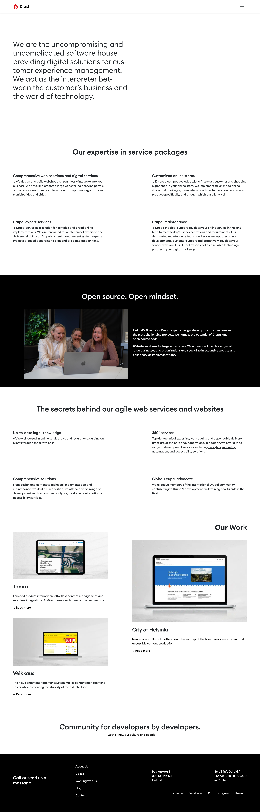
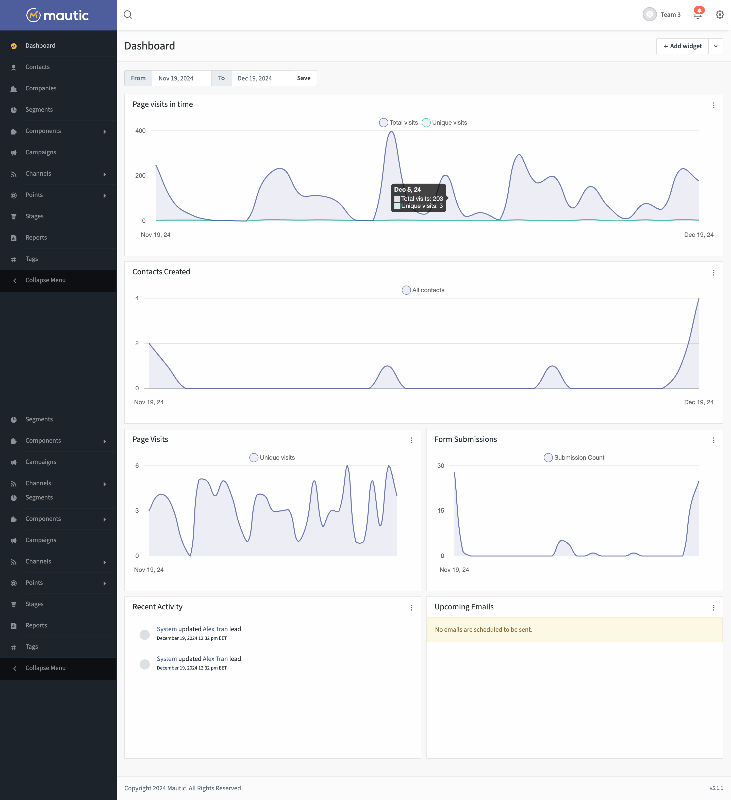

# Druid_Partnering_Project_React24k
A decoupled full-stack company website features React, Drupal, Mautic analytic tool and Content personalization system. 

This is a team project from the company Druid about creating a new website for their business as a final assignment for Business College Helsinki students.

## Live site
- Live client site: [https://druid-project.alextran.dev](https://druid-project.alextran.dev)
- Drupal backend: [https://dev-druid-partnering-project-react24k.pantheonsite.io/](https://dev-druid-partnering-project-react24k.pantheonsite.io/)
- Mautic analytics dashboard: [https://mautic.alextran.cloud/](https://mautic.alextran.cloud/)

## Functions:
- Different pages based on client's need
- Client can use the Drupal page builder to change page contents, add new sections, move and update existed sections, etc.
- Analytic tool collect user activities, data and categorize user into segments
- Content personalization system help boosting conversion rate of the site
- The React frontend client is lighning fast, lightweight, responsive and mobile friendly
- The Drupal backend server is robust, well-structured and secured

## Technologies used

Languages:
- JavaScript
- PHP

Frontend:
- Redux
- Bootstrap

Backend:
- Drush
- Drupal Paragraphs
- Drupal Rest Entity Recursive
- Drupal Json Api Extras
- Drupal Key Auth
- Drupal Require Login
- Drupal Entity clone
- Mautic Api Library
- Drupal Mautic Paragraph
- Composer patches

Analytic:
- Mautic

## Setup and usage
**To host project locally**
- Clone the project
- Change working directory ```cd Druid_Partnering_Project_React24k```

**TODO**
Setup the Drupal Backend:
_Make sure your local environment have Lando and Docker Desktop_
- Change working directory: `cd Backend/`
- Install dependencies: `lando composer install`
- Start the local container in Docker desktio: `lando start`
- Import the database: `lando db-import 2.0.gz`
- Import Drupal config: `lando drush cim`

Setup the React Frontend:
_Make sure your local environment have node version 22 or later_
- Change working directory: `cd ../Frontend/` or `cd Frontend/`
- Install dependencies: `npm install`
- Create an .env file in the Frontend folder: `touch .env.local`
- Add nessessary env variable to the newly created file in this format: 
```shell
VITE_DRUPAL_URL=http://druidpartneringapp.lndo.site/api/
VITE_MAUTIC_URL=LINK_TO_YOUR_MAUTIC_INSTANCE
VITE_DRUPAL_REST=https://druidpartneringapp.lndo.site/api/
VITE_MAUTIC_API_TOKEN=YOUR_MAUTIC_API_TOKEN
```
- Start the dev server: `npm run dev`
- Check the port in the terminal to access the frontend page

Setup a local Mautic instance for activities tracking:
- Follow the official Mautic guide [here](https://github.com/mautic/mautic)
- Remember to update the .env.local file with the nessessary variable after setting up Mautic instance

## Screenshot
**Homepage Screenshot**


**Mautic**


## Acknowledgment
- Special thanks to our client [Druid](https://druid.fi) for this wonderful project.

- Big thanks to our teacher at Helsinki Business College for the best guidance, teaching and to be our mentor for this project: [Margit Tennosaar 🦊](https://github.com/margittennosaar) & [Santosh Kalwar](https://github.com/kalwar)

- Thank you [Laurie](https://github.com/laurielim/), [Oscar](https://github.com/OscarJonasson) and other Druids for all the help during development.

## For development team
### Setup the dev environment
1. Clone the project: `git clone https://github.com/Randolph-dev/Druid_Partnering_Project_React24k.git`
2. Change to frontend directory: `cd Druid_Partnering_Project_React24k/Frontend`
3. Install frontend dependencies: `npm i`
4. Create a .env file inside Frontend/ and add the required variable in this format:
```bash
VITE_DRUPAL_URL=http://YOUR_LOCAL_DRUPAL_URL/api/
VITE_MAUTIC_URL=https://mautic.alextran.cloud/
```
5. Host the frontend in local server: `npm run dev`
6. Open a new terminal, cd to backend folder `cd Druid_Partnering_Project_React24k/Backend`
7. Build and start a lando docker contaienr `lando start`
8. Install dependencies `lando composer i`
9. Import drupal db: `lando db.import LATEST_DB_NAME.gz`
10. Import drupal config: `lando drush cim`
11. To find the backend port and other useful info, run `lando info`
12. To change Drupal admin password ```lando drush upwd admin ”newpassword”```
**To pull the latest changes:** ```git pull origin BRANCH_NAME``` or to pull all branches ```git pull origin```

### Working on a ticket
1. Choose a ticket in the current sprint
2. Assign yourself to a ticket
3. Click on the ticket
4. Create a branch using Jira **BRANCHING FROM DEV, NOT MAIN** and copy the branch name
5. Pull the branch `git pull origin BRANCH_NAME`
6. Checkout the branch `git checkout -b BRANCH_NAME`
7. Commit your changes `git commit -m "SCRUM-xx <message>"`
8. Push the changes to your branch `git push origin BRANCH_NAME`
#### **never push to main**
9. Add a PR description. Use [This PR template](PR_template.md)
10. Wait for the PR to merge, if closed, checkout the same branch and continue working on it

### To review a PR
1. Pull the branch ```git pull origin BRANCH_NAME```
2. Checkout the branch ```git checkout -b BRANCH_NAME```
3. Follow PR instructions
4. Test the page to see if it match the feature descriptions
5. 
- If the PR is not working or not up to standard, write the reason in github and close the PR
- If the PR is good for production, merge the request and **delete the branch**
6. Update the ticket in Jira to done

### To access live site
- Drupal: Hosted with Pantheon [https://dev-druid-partnering-project-react24k.pantheonsite.io/](https://dev-druid-partnering-project-react24k.pantheonsite.io/)
- React: Hosted with Netlify [https://druid-project.alextran.dev](https://druid-project.alextran.dev)
- Mautic: Deployed a dockerized version in private server [https://mautic.alextran.cloud/](https://mautic.alextran.cloud/)

### Mautic
- Mautic used to be a folder living in this repo but because it is too heavy and require setting up on all local machine,
it is now installed online
- Here is the link to Mautic dashboard: [https://mautic.alextran.cloud/](https://mautic.alextran.cloud/)
- Remember to set the Mautic link as environment variable for it to track properly
- Ask or check the message channel for the login credential

### Possible issues during Mautic set up (outdated with the latest update)
Some issues may appear during Mautic's installation process. Most of which are caused by the composer install. Some of them can be:
- Memory exhaustion issue with PHP - allowed PHP memory space isn't enough to handle the operations required for the install. Solution: increase memory limit with ```php -d memory_limit=-1 bin/ ```
- Composer extension errors - failure to install in the working repository. Solution: Ran composer with ignore commands to keep the install process while ignoring the problematic extensions ```composer install --ignore-platform-req=ext-imap --ignore-platform-req=ext-redis```
- Security issues - Some files can be interrupted during the install due to dubios origin/authors. This can be solved by whitelisting the files.
- If you encounter issues such as too many files being commited, this is possibly caused by .gitignore failing to properly ignore the specified content. Run ```git rm -r --cached .``` (or to force) ```git rm -r --cached . -f``` to clear tracking of all files and re-add only the files specified for tracking based on .gitignore settings. 
